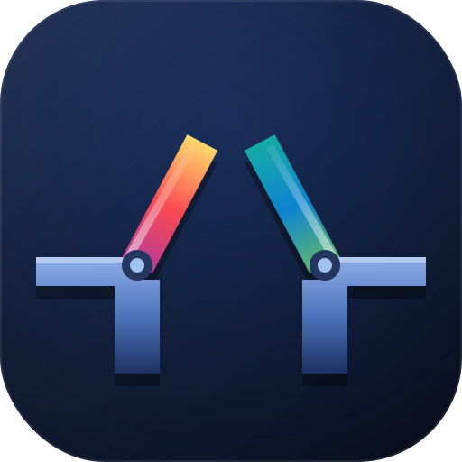

<div align="center">

  <br />

  

  <br />

# OpenBridge

**Local-first home automation bridge for developers. Plugin-based, TypeScript-first, Homebridge-compatible.**

[](https://github.com/nubisco/openbridge/actions/workflows/ci.yml)
[](https://github.com/nubisco/openbridge/releases)
[](https://www.npmjs.com/package/openbridge)
[](https://nodejs.org/)
[](https://pnpm.io/)
[](LICENSE)
[](docs/CLA-INDIVIDUAL.md)

</div>

---

## Table of Contents

- [Why OpenBridge?](#why-openbridge)
- [Features](#features)
- [Quick Start](#quick-start)
- [Development](#development)
- [Writing a Plugin](#writing-a-plugin)
- [Configuration](#configuration)
- [HTTP API](#http-api)
- [Monorepo Structure](#monorepo-structure)
- [License](#license)

---

## Why OpenBridge?

Homebridge works, but it was designed for a different era. OpenBridge is built from scratch with a developer-first philosophy:

- **No cloud, no accounts** — the HAP bridge is published directly on your local network
- **Clean plugin SDK** — `setup / start / stop` lifecycle, one exported object, full TypeScript types
- **Drop-in Homebridge compatibility** — existing `platform` plugins work with zero modification
- **Built-in dashboard** — Vue 3 UI included; no separate install needed
- **Full HTTP API** — everything the UI does, your scripts can do too
- **MIT licensed** — no paid tiers, no telemetry, no gatekeeping

---

## Features

- Plugin lifecycle management (load, start, stop, reload)
- HAP bridge via hap-nodejs — exposes accessories to Apple Home
- Homebridge platform plugin compatibility shim
- Vue 3 dashboard — accessories, plugins, logs, config editor, terminal
- REST API + WebSocket streams for logs and metrics
- Zod-validated JSON config
- Structured logger with in-memory buffer

---

## Quick Start

**Requirements:** Node.js 20+, pnpm 9+

```bash
# Install dependencies
pnpm install

# Build everything
pnpm build

# Start the daemon
node apps/daemon/dist/index.js
```

Open **http://localhost:8582** — the dashboard loads immediately.

---

## Development

```bash
# Build all packages once
pnpm build

# Start the daemon in watch mode (terminal 1)
pnpm --filter @nubisco/openbridge-daemon dev

# Start the UI dev server with HMR (terminal 2)
pnpm --filter @nubisco/openbridge-ui dev
# → UI at http://localhost:5174 (proxies /api and /ws to daemon on :8582)
```

To rebuild individual packages during development:

```bash
pnpm --filter @nubisco/openbridge-core dev       # watch mode
pnpm --filter @nubisco/openbridge-logger dev
```

---

## Writing a Plugin

```typescript
import { definePlugin } from '@nubisco/openbridge-sdk'

export default definePlugin({
  manifest: {
    name: 'my-plugin',
    version: '1.0.0',
    description: 'Does something useful',
  },

  async setup(ctx) {
    ctx.log.info('Setup — runs once at load time')
  },

  async start(ctx) {
    ctx.log.info('Start — begin plugin operation')
    // ctx.config has values from config.json
  },

  async stop(ctx) {
    ctx.log.info('Stop — clean up resources')
  },
})
```

For a full guide, see the [Plugin Development docs](apps/docs/docs/guide/creating-a-plugin.md).

---

## Configuration

Default config path: `~/.openbridge/config.json`

```json
{
  "bridge": {
    "name": "My OpenBridge",
    "port": 8582,
    "logLevel": "info"
  },
  "plugins": [
    {
      "name": "my-plugin",
      "enabled": true,
      "config": {
        "interval": 5000
      }
    }
  ]
}
```

See [Configuration Reference](apps/docs/docs/guide/config-reference.md) for all options.

---

## HTTP API

The daemon exposes a REST API on port 8582:

| Method | Path                       | Description               |
| ------ | -------------------------- | ------------------------- |
| GET    | `/api/health`              | Daemon status and version |
| GET    | `/api/plugins`             | List all loaded plugins   |
| GET    | `/api/plugins/:id`         | Get a single plugin       |
| POST   | `/api/plugins/:id/start`   | Start a plugin            |
| POST   | `/api/plugins/:id/stop`    | Stop a plugin             |
| GET    | `/api/accessories`         | List all HAP accessories  |
| GET    | `/api/logs?plugin=&limit=` | Retrieve log entries      |
| WS     | `/ws/logs`                 | Stream live logs          |
| WS     | `/ws/shell`                | Interactive terminal      |

Full reference: [HTTP API docs](apps/docs/docs/guide/api-reference.md).

---

## Monorepo Structure

```
openbridge/
  apps/
    daemon/     Node.js runtime — plugin loader + Fastify HTTP API + HAP bridge
    ui/         Vue 3 dashboard — accessories, plugins, logs, config, terminal
    cli/        CLI — openbridge start / plugins list / logs
    docs/       VitePress documentation site
  packages/
    core/       Plugin types, registry, lifecycle, loader
    logger/     Structured logging with in-memory buffer + WebSocket
    config/     Zod-validated JSON config
    sdk/        definePlugin() helper for plugin authors
    compatibility-homebridge/  Homebridge platform plugin adapter
```

---

## Contributing

Contributions are welcome. Please read [CONTRIBUTING.md](CONTRIBUTING.md) before opening a pull request. All contributions are made under the [Individual CLA](docs/CLA-INDIVIDUAL.md).

---

## Security

To report a vulnerability, please use [GitHub Security Advisories](https://github.com/nubisco/openbridge/security/advisories/new) rather than opening a public issue. See [SECURITY.md](.github/SECURITY.md) for the full policy.

---

## Support this project

If OpenBridge is useful to you, consider [sponsoring the maintainer](https://github.com/sponsors/joseporto).

---

## License

MIT — see [LICENSE](LICENSE).

Part of the [Nubisco](https://nubisco.io) ecosystem.
