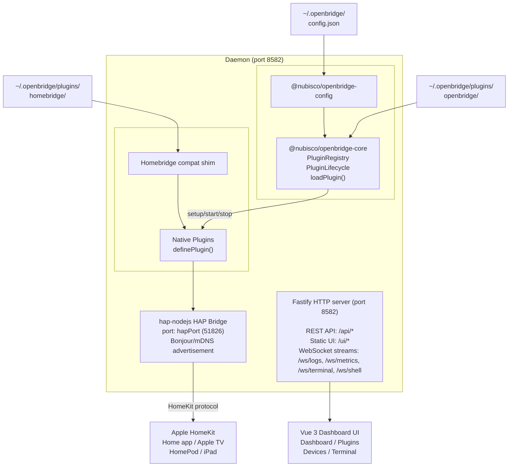

# Architecture

This page explains how OpenBridge is structured internally, how data flows through the system, and why the pieces are split the way they are.

---

## Data flow diagram



---

## Packages

| Package                                        | Responsibility                           | Key exports                                                                                                                    |
| ---------------------------------------------- | ---------------------------------------- | ------------------------------------------------------------------------------------------------------------------------------ |
| `@nubisco/openbridge-core`                     | Plugin types, registry, lifecycle engine | `Plugin`, `PluginManifest`, `PluginContext`, `PluginRegistry`, `PluginLifecycle`, `loadPlugin()`, `loadPluginsFromDirectory()` |
| `@nubisco/openbridge-sdk`                      | Plugin authoring surface                 | `definePlugin()`, re-exports of all core types                                                                                 |
| `@nubisco/openbridge-config`                   | Zod-validated config load/save           | `loadConfig()`, `saveConfig()`, `ConfigSchema`                                                                                 |
| `@nubisco/openbridge-logger`                   | Scoped structured logger                 | `Logger.create(name)`, `Logger.subscribe(fn)`, `Logger.getEntries()`                                                           |
| `@nubisco/openbridge-compatibility-homebridge` | Homebridge API shim                      | `HomebridgeAPI`, `PlatformAccessory`, `Service`, `Characteristic`                                                              |

**`apps/daemon`** orchestrates everything: it imports from all packages, owns the Fastify server, manages the HAP bridge, and is the only app that touches the filesystem for config and plugin discovery.

**`apps/ui`** is a fully static Vue 3 app. In production it is built to `apps/ui/dist/` and served by the daemon. In development it runs on its own Vite dev server (port 5174) that proxies API calls to the daemon.

**`apps/cli`** provides the `openbridge` command. Currently a thin wrapper — most operations are done via the daemon API.

---

## Data flow, step by step

1. **Config load** — `@nubisco/openbridge-config` reads `~/.openbridge/config.json`, parses it, and validates it against the Zod schema. Invalid config throws with a structured error listing every invalid field.

2. **Logger init** — `@nubisco/openbridge-logger` is initialized. It creates an in-memory ring buffer and starts accepting subscriptions. Anything that calls `Logger.create()` gets a scoped logger that writes to the shared buffer.

3. **Plugin discovery** — the daemon scans `~/.openbridge/plugins/openbridge/` (and any `localPluginSources`). For each subdirectory with a `dist/index.js`, it calls `loadPlugin()` which dynamically imports the module and reads `module.default`.

4. **Plugin registration** — each loaded plugin is added to `PluginRegistry` with status `Pending`. Plugins from `platforms[]` are loaded through the Homebridge shim instead.

5. **Lifecycle: setup** — `PluginLifecycle` calls `plugin.setup(ctx)` on each plugin in order. Each gets its own `ctx` with `config` from the matching `plugins[]` entry (or `{}` if none) and a scoped `log` from `@nubisco/openbridge-logger`.

6. **Lifecycle: start** — after all `setup()` calls complete, `start(ctx)` is called on each plugin. Plugins may begin polling, opening sockets, or registering HAP accessories here.

7. **HAP bridge starts** — hap-nodejs publishes the bridge via Bonjour/mDNS on `hapPort`. Accessories registered by plugins during `start()` become visible to HomeKit.

8. **HTTP server starts** — Fastify starts listening on `port`. All REST routes and WebSocket handlers are registered. The built UI is served from `apps/ui/dist/`.

9. **Shutdown** — on SIGINT or SIGTERM, `PluginLifecycle` calls `stop(ctx)` on each plugin in reverse start order, waits for all to resolve, then closes the Fastify server and HAP bridge.

---

## Storage layout

```
~/.openbridge/
  config.json                  ← Main config (read on startup, written by API)
  hap-storage/                 ← HAP pairing data (managed by hap-nodejs)
    *.json
  plugins/
    openbridge/                ← Native plugins (auto-scanned)
      my-plugin/
        dist/
          index.js
        package.json
    homebridge/                ← Homebridge npm packages
      node_modules/
        homebridge-shelly-ds9/
        homebridge-tplink-smarthome/
```

---

## Plugin discovery order

For native plugins, the daemon discovers plugins in this priority order:

1. **Explicit `path` entries** in `plugins[]` — loaded first, path is used directly.
2. **`~/.openbridge/plugins/openbridge/`** — each subdirectory with `dist/index.js`.
3. **`localPluginSources`** directories — same scan as step 2, in array order.

If the same `manifest.name` is found more than once, the first discovery wins and a warning is logged.

---

## Log pipeline

Every log call flows through this pipeline:

```
plugin.ctx.log.info('message')
  │
  ▼
@nubisco/openbridge-logger  ←  Logger.create('plugin-name')
  │
  ├──▶ stdout (formatted with timestamp + level + name)
  │
  ├──▶ In-memory ring buffer (capped at N entries)
  │      └──▶ GET /api/logs?plugin=&limit=  (REST query)
  │
  └──▶ Subscribers  (added via Logger.subscribe())
         └──▶ /ws/logs WebSocket  (streamed JSON)
         └──▶ /ws/terminal WebSocket  (ANSI formatted, for xterm.js)
```

---

## HAP bridge lifecycle

The HAP bridge is the component that HomeKit actually talks to. Its lifecycle is separate from the plugin lifecycle:

1. **Bridge created** — a `Bridge` object is created from hap-nodejs with the name, username, and pincode from config.
2. **Accessories registered** — plugins call HAP APIs during `start()` to add accessories to the bridge.
3. **Bridge published** — `bridge.publish()` starts the Bonjour advertisement and opens the HAP socket on `hapPort`.
4. **Pairing** — when the user scans the QR code or enters the PIN in the Home app, hap-nodejs handles the Secure Remote Password (SRP) handshake and stores the paired client credentials in `~/.openbridge/hap-storage/`.
5. **Characteristic reads/writes** — the Home app sends HAP requests to read or control accessories. hap-nodejs routes these to the handlers registered by plugins.
6. **Shutdown** — `bridge.unpublish()` closes the HAP socket. Paired client credentials remain in storage for the next startup.

---

## Related pages

- [Concepts](/guide/concepts) — vocabulary for the pieces described here
- [Plugin API Reference](/guide/plugin-api) — the interfaces used in step 5 and 6
- [Homebridge Compatibility](/guide/homebridge-compatibility) — how the shim fits in
